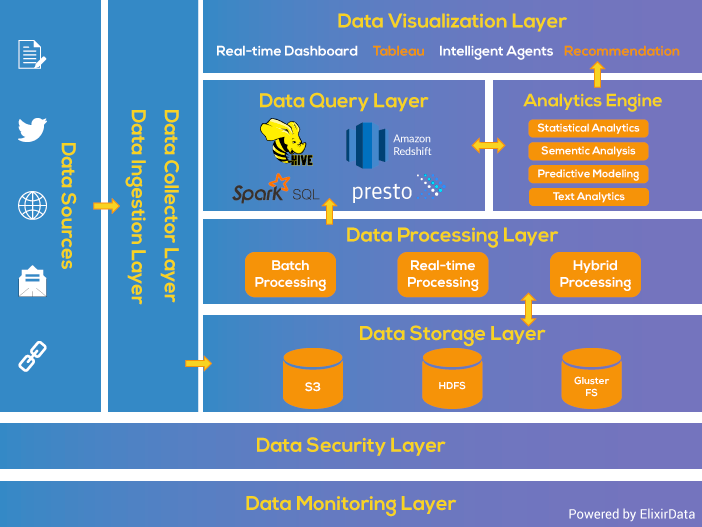
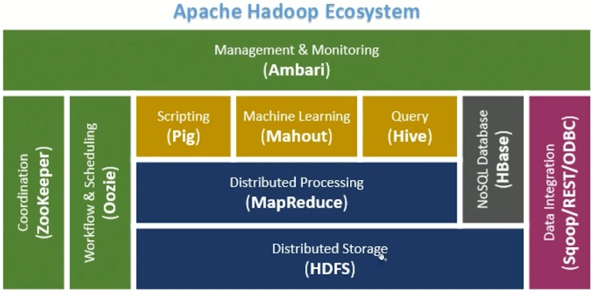
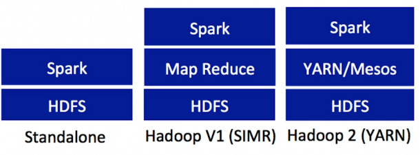
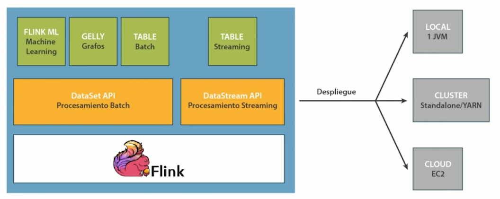
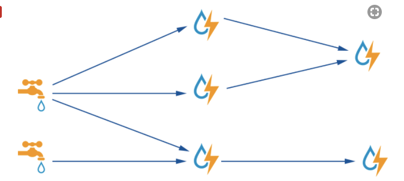
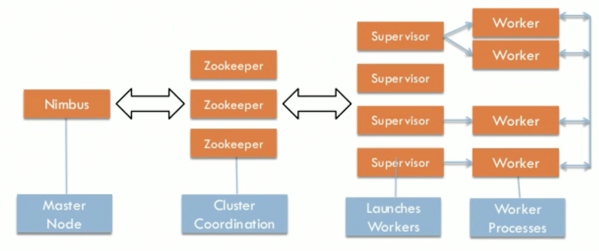

# Curso Big Data OpenWebinars

> Big data o datos a gran escala es un concepto que hace referencia a un conjuntos de datos tan grandes que aplicaciones informáticas tradicionales de procesamiento de datos no son suficientes para tratar con ellos
> 
> Wikipedia
> 

Otra definición:

> La habilidad de aprovechar la información para conseguir crear ideas novedosas y con ello valor.
> 
> Viktor Mayer

## Las 4 V's

* Volumen
* Velocidad: Con la que se producen los datos y con la que se genera información para los que están esperando
* Variedad: Datos estructurados, no estructurados, imágenes, ...
* Valor: Convertir (la gran cantidad de) datos en información útil

## Características comunes de los sistemas Big Data

* Procesamiento distribuido
* Escabilidad horizontal
* Tolerancia a fallos
* Localidad de datos: Cada nodo trabajará con los datos que tenga más cercanos para aumentar el rendimiento.
* Hardware económico
Estas características son básicas y necesarias en todo sistema, puesto que la unión de estas características es lo que nos hace poder tratar una gran cantidad de datos en un tiempo digno y con una probabilidad baja de fallo.

## Funcionamiento de los Sistemas Big Data

* Ingesta de los datos
* Almacenamiento de los datos
* Procesamiento de los datos
* Visualización

## Casos de uso

* Procesamiento de logs
* Sistemas de recomendación
* Salud: Procesamiento de análisis clínicos, ADN, hábitos alimenticios, ...
* Financiero: Análisis de datos financieros para la recomendación en inversiones.

## Big data en cifras (2017)


## Big data framework
 


## Hadoop

Framework open source para procesamiento distribuido

* Facilmente escalable
* Tolerante a fallos
* Trabaja en disco

## Módulos Hadoop

* Common utilities: Scripts, ... (core) para que el resto funcione
* YARN *(Yet Another Resource Negociator)*. Gestiona recursos, repartiendo memoria, asignando recursos, ...
* HDFS: Sistema de archivos distribuido (ofrece replicación de datos, cercanía de datos, ...)
* MapReduce: Map agrupando, creando pequeños saquitos que luego son pasados al proceso Reduce. 

## Cluster Hadoop 

* 1 máquina maestra (head node)
* 1 máquina maestra secundaria opcional
* N máquinas esclava (worker node)
.png


* Oozie permite automatizar mediante scripts tareas rutinarias y programables en el tiempo (carga datos, distribuye a tal lugar, procesa de tal manera, vuelca a tal sitio, ...)
* Scoop carga y exporta datos entre las fuentes y HDFS
* Hive permite consultar fácilmente fuentes de datos de cualquier tipo y sobre peticiones de archivos que están en HDFS
* Ambari permite gestionar el cluster Hadoop en cuanto a recursos (p.e. máquinas) y servicios (p.e. ZooKeeper, HBase, ...) (Similar a Cloudera-Manager).

## Hadoop en acción

* Descargar Cloudera VM (12 GB RAM)
* Inicializar Cloudera en cada arrancque con `sudo /home/cloudera/cloudera-manager ... --express --force `
* El navegador de la MV tiene un enlace a Cloudera-Manager
* Los componentes Hadoop son roles en Cloudera-Manager. Deberían ir a los worker node, y dejar el nodo master para la coordinación.

### Apache Hue

* Interactúa con procesos map-reduce y HDFS para la gestión de archivos. * Usar la demno de Apache Hue en Cloudera (http://demo.gethue.com/)

### Apache Spark

* Sistema de computación de datos sobre Hadoop
* Trabaja en memoria. 100 veces más rápido que Hadoop
* También permite trabajar en disco si se llena la RAM
* Ofrece Spark SQL, Spark Streaming para procesamiento en tiempo real, Spark MLib para Machine Learning y Spark Graph (Procesamiento de grafos)



* Stadalone: Descarga una versión compilada y se añade a cada una de los nodos (https://spark.apache.org/docs/latest/spark-standalone.html)
* Spark en Mesos (Mesos hace el papel de gestor de recursos -YARN) (https://spark.apache.org/docs/latest/running-on-mesos.html)
* Spark sobre YARN ()

___
> Accederemos a Apache Spark a través de la MV de Cloudera
___

## Apache Flink

* Framework para procesamiento distribuido de flujos de datos. 
* También sirve para procesamiento por lotes
* Eficaz y preciso aunque los datos lleguen tarde y desordenados
* Tolerante a fallos
* Buen rendimiento en clusters con gran cantidad de nodos



* APIs para procesamiendo de datos
* Librerías para ML (FLINK ML)
* Librerías para grafos (GELLY)
* Librería para consulta con sintaxis similar a SQL (TABLE)

____
> Seguir el QuickStart de Apache Flink
____

## Apache Storm

* Framework para procesamiento distribuido de datos **en streaming**
* Tolerante a fallos (el resto de máquinas hace el trabajo de la máquina que cae)
* Alta disponibilidad
* Pensado para tratamiento de datos en tiempo real (sensores, tweets, ...=
* Storm utiliza un grafo dirigido en el que los trabajos van pasando de una etapa a otra

### Componentes de Apache Storm



* Spout (Grifo): Recoge el flujo de datos en tiempo real
* Bolt (Rayo): Procesamiento y transformación de datos

### Arquitectura de Apache Storm



### Ejemplo de Apache Storm

Seguir los pasos de http://storm.apache.org/releases/1.1.1/Setting-up-a-Storm-cluster.html

* Instalar Java
* Instalar Zookeeper
* Instalar Apache Storm


```
Detalles

www.osboxe
s.org // Máquinas virtuales con SO instalados
sudo update-alternatives --config java // Ruta en la que está instalado Java
Cargar la variable de entorno en ~/.profile 
    export JAVA_HOME=lo_que_devolvio_update_alternatives
    export PATH=$PATH:$JAVA_HOME/bin
```

## Apache Samza

* Framework de procesamiento asíncrono de streaming
* Muy intetgrado con Apache Kafka para la carga de datos
* Usa YARN de Hadoop para la gestión del cluster y la tolerancia a fallos

----
Enlaces:

* Visión general: http://samza.apache.org/learn/documentation/0.13/introduction/background.html

----